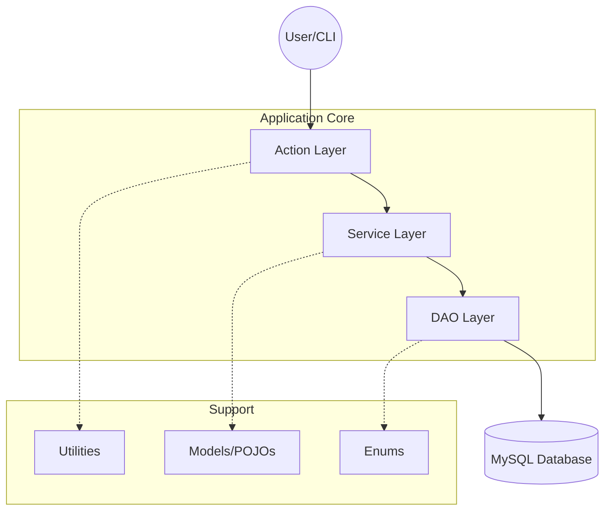

# Event Management System (EMS)

A sophisticated, multi-tiered Java application designed for robust event orchestration. This project serves as a showcase for clean architecture, enterprise design patterns, and rigorous separation of concerns.

---

## �️ Architecture Overview

The system is built on a **Modular Tiered Architecture**. Each tier is isolated and communicates only with adjacent tiers through well-defined interfaces.



### 🧱 Separation of Concerns

| Layer | Responsibility | Key Components |
| :--- | :--- | :--- |
| **Action** | Flow Control & Input Validation | `AdminUserManagementAction`, `EventBrowsingAction` |
| **Service** | Complex Business Logic & Rules | `EventServiceImpl`, `UserServiceImpl` |
| **DAO** | Persistent Data Access (CRUD) | `UserDaoImpl`, `NotificationDaoImpl` |
| **Model** | Data Transfer & Representation | `User`, `Event`, `Registration` |
| **Util** | Cross-cutting Concerns | `DBConnectionUtil`, `DateTimeUtil`, `ApplicationUtil` |

---

## 🛠️ Design Patterns & Coding Standards

### 1. Data Access Object (DAO) Pattern
Encapsulates all database-specific logic. By using interfaces (e.g., `UserDao`), the business logic remains decoupled from the underlying database implementation, allowing for seamless transitions between different storage solutions.

### 2. Service Layer Pattern
Centralizes business rules. This prevents "Leaky Abstractions" where logic might traditionally spill into the UI or DB layers. Services coordinate multiple DAO calls within a single business operation.

### 3. Singleton & Factory (via `ApplicationUtil`)
The `ApplicationUtil` acts as a simplified **Dependency Injection (DI)** container. It ensures that DAO and Service instances are singletons, reducing memory overhead and maintaining a single source of truth for the application state.

### 4. Interface-Based Programming
We "Program to an Interface, not an Implementation." This core OOP principle allows us to mock components during testing and ensures strict contracts between different modules.

### 5. Strongly Typed Enums
To eliminate the "Magic String" anti-pattern, we use Enums (`UserStatus`, `RegistrationStatus`, `NotificationType`) throughout all layers. This guarantees type safety from the Database level up to the UI.

---

## 📂 Detailed File Structure

```text
src/main/java/com/ems/
├── App.java                   # Main entry point; initializes menus
├── actions/                   # Orchestrators; handle user-specific workflows
├── dao/                       # Data Access interfaces (The "What")
│   └── impl/                  # JDBC/SQL implementations (The "How")
├── enums/                     # Domain constants (Status, Roles, Types)
├── exception/                 # Business & Technical custom exceptions
├── menu/                      # CLI navigation and rendering logic
├── model/                     # Rich Domain Models (State-only POJOs)
├── service/                   # Business Logic definitions
│   └── impl/                  # Core logic implementations
└── util/                      # Reusable infrastructure code
```

---

## � Key Implementation Details

### Database Integrity
- **Stored Procedures**: High-criticality operations like `sp_register_for_event` are implemented as Stored Procedures to leverage database-level atomicity and prevent race conditions (overbooking).
- **Relational Constraints**: Hard FK constraints across `users`, `events`, and `registrations` ensure data consistency even during manual interventions.

### Security
- **Password Hashing**: We utilize `BCrypt` (simulated in `PasswordUtil`) to ensure user credentials are never stored in plain text.
- **Input Sanitization**: All CLI inputs pass through `InputValidationUtil` to prevent buffer overflows and malformed data entry.

---

## ⚙️ Setup & Development

### Prerequisites
- Java JDK 8+
- MySQL Server 8.0+
- JDBC Driver (MySQL Connector/J)

### Installation
1.  **Database**: Run `src/main/java/sql/schema.sql` to initialize the tables.
2.  **Seed Data**: Run `src/main/java/sql/sample_data.sql` to populate 15+ events and test users.
3.  **Connection**: Update `DBConnectionUtil.java` with your MySQL credentials.
4.  **Run**: Execute `App.main()` to launch the CLI interface.

---

## 📈 Scalability
The architecture is designed to be **Cloud-Ready**. The clean separation of the Service layer allows for a future migration from a CLI UI to a REST API or Web-based frontend without changing a single line of business logic or DAO code.